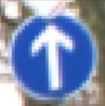
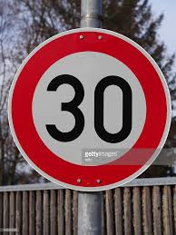
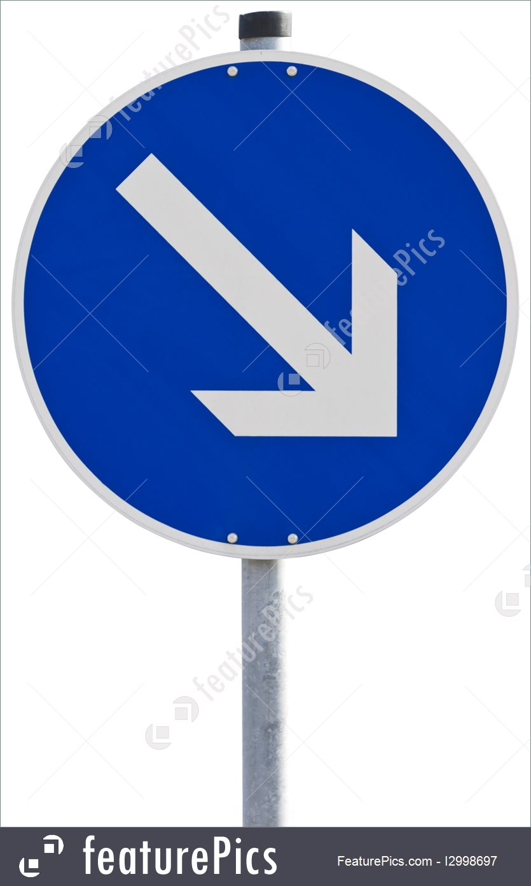
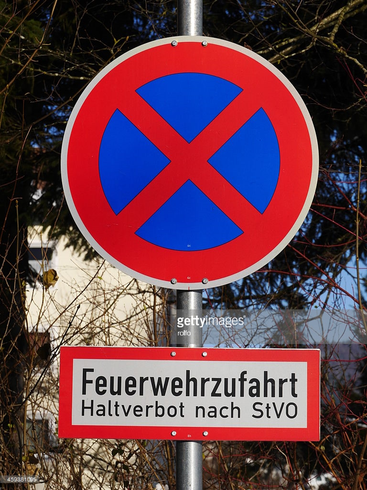
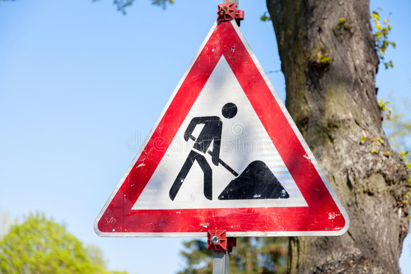

# JUST READ THE SIGNS
---
### Data Set Summary & Exploration

German Traffic Sign Data gathered from

* Training set has 34,799 images
* Validation set has 12,630 images
* Test set has 12,630 images

* Each image comes in a 32 x 32 x 3 format

* There are 43 different types of signs.

Example Image from DataSet

### Design and Test a Model Architecture

In order to effectively train the model the images need to all be the same size and shape. 
Thankfully this huge dataset has already been partially preprocessed. 
All of the images come in  32 x 32 x 3 format. This reduces a ton of preprocessing headaches. 
This will allow us to pass them into the neural net with minimal processing on our end.

With Numpy Array and math...
 - Grey Scale: Sum of RGB/3 

 - Normalize: (Each pixel-128)/128
 

The dataset could be processed further by taking the existing images from the dataset and augmenting them slightly in order to make them unique enough from there counterparts that dataset would be larger and have even more examples to train on.

### MODEL ARCHITECHTURE

My final model consisted of the following layers:

|          			|     Output | Description	        					
|:---------------------:|:--:|:---------------------------------------------: 
| LAYER 1 |
| Input      		| | 32x32x1 GreyScale image   			
| Convolution 3x3    | 28x28x6	| 1x1 stride, Valid padding 	
| Activation				| 	|			RELU									
| Max pooling	   | 14x14x6  	| 2x2 stride, Valid padding				
|||
| LAYER 2| |
| Convolution 3x3   | 10x10x16  	| 1x1 stride, Valid padding 	
| Activation			||	RELU											
| Max pooling	  | 5x5x16   	| 2x2 stride, Valid padding	
| Flatten | 400  |
|||
| LAYER 3| |
| Fully Connected	| 120    |
| Activation |     		| RELU			
|||
| LAYER 4| |
| Fully connected	| 84	|    					
| Activation			|  | RELU							
|||
| LAYER 5|	
| Fully connected	| 43	|       						
									
 

 This architechture could further be improved by adding drop out.
 The training model could be further improved by running for more than 12 epochs.

### TRAINING

To train the model, I used a LeNet with the following HyperParameters....

 - Epochs : 12
 - Batch Size : 256
 - Learn Rate : .009
 - Optimizer : Adam

 Started off Running Base LeNet, almost was good enough on first try.

 Further dialed in by playing with learn rate. When that was not meeting the mark, I switched batch size from 128 to 256. This greatly increased the model's accuracy. 

 Then just started fluctating number of epochs. Consistently was having model peak at around 80% through whatever number of epochs I used. 

 Finally got a good one that kept the accuracy at about 93%.

### METHODOLOGY

My final model accuracies:
* validation : .931
* test : .905
* web : .60

LeNet was used to process these images. It already accepted 32 x 32 x 1 images. It was easy to first edit the model to accept 32 x 32 x 3 but then decided to just to feed it greyscale images and switched it back to 32 x 32 x 1. It definitely performed with a really high accuracy on the different sets of data and the random images I fed it which is covered below. And there is potentially the human error of me misclassifying them and the model actually having guessed them correctly. It wasn't super easy to look up what a random sign was. I don't know the names of signs in the US let alone the names of the diverse set found in Germany.
 

### LITMUS TEST - images from outside of dataset

I googled German Traffic Signs. Downloaded 5. Tried to figure out what signs they were(as mentioned above I'm not super confident about my ability to identify German signs).

Here they are...

For this very reason it is also impressive that the model was able to correctly predict 60% of the photos I threw at it. As you can see the photos I pulled from the internet were not appropriatley sized for the model, they had watermarks, and one had a mini sign below it that potentially could throw off the models ability to predict. I basicly gave it trash and it did magic.

SideNote: I am really impressed by the image transformation powers of OpenCV. With a single line the randomly sized photo I loaded into the system was transformed into a 32x32x3. There definitely was a bit of squish but overall photo looked the same and it didn't seem to effect the models guesses.

RESULTS

| Image			        |     Prediction	        					
|:---------------------:|:---------------------------------------------: 
| Speed Limit 30      		| Speed Limit 30  									 
| Keep Right     			| No Passing										
| No Passing			| Roundabout Mandatory										
| Road Work      		| Road Work					 				
| No Entry		| No Entry      							

The model was able to correctly guess 3 out of 5 signs, which gives an accuracy of 60%. This really impresses me given that these are wild signs, are heavily edited, and I potentially misclassified them. I feel confident that I guessed at least 3 right if the model agreed with me!

### So the thought process of the model was as follows...

First Sign: Speed Limit 30

| Probability         	|     Prediction	        					 
|:---------------------:|:---------------------------------------------: 
| 1.00         			| Speed Limit 30   								 
| .00    				| Right-of-way at the next intersection										
| .00					| Bicycles crossing											
| .00     			| Keep right					 			
| .00				    | Speed Limit 50      							

Second Sign: Keep Right

| Probability         	|     Prediction	        					
|:---------------------:|:---------------------------------------------: 
| .77        			| No Passing   									 
| .23  				| Priority road										
| .00					| Slippery Road											
| .00	      			| Roundabout Mandatory					 		
| .00			    | Right-of-way at the next intersection     							

Third Sign: No Passing

| Probability         	|     Prediction	        					
|:-------------------:|:---------------------------------------------: 
| .995        			| Roundabout Mandatory   									 
| .004     				| Slippery Road										
| .00					| Go straight or left											
| .00	      			| Traffic signals					 				
| .00				    | General caution      							

Fourth Sign: Road Work

| Probability         	|     Prediction	        					
|:---------------------:|:---------------------------------------------: 
| 1.00         			| Road Work   									 
| .00    				| Bicycles crossing 										
| .00					| Wild animals crossing										
| .00	      			| Double curve					 				
| .00				    | Beware of ice/snow    							

Fifth Sign: No Entry

| Probability         	|     Prediction	        					
|:---------------------:|:---------------------------------------------: 
|  1.00         		| No Entry 									 
| .00    				| Stop 										
| .00					| Turn right ahead										
| .00	      			| End of all speed and passing limits					 				
| .00    				| Beware of ice/snow

Interesting to see that the two that it got incorrect are arguably the worst photos of the 5 havin multiple things in them that look like other signs.
### Overall Awesome Stuff :)